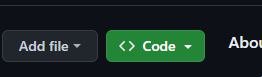
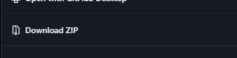

# Instalacja

### 1. Pobierz Node.js w wersji przynajmniej 20:

https://nodejs.org/en

### 2. Pobierz kod:

- poprzez użycie komendy `git clone https://github.com/Aadameqq/shop-with-ease-developers_shop-with-ease.git` (działa jedynie, gdy git jest zainstalowany)
- lub poprzez:
  - kliknięcie przycisku "Code"
    <br>
  - następnie kliknięcie przycisku "Download Zip"
    <br>

### 3. W folderze głównym wykonaj poniższe komendy:

```
npm ci
npm run build
npm run start
```

### 4. Po chwili strona powinna znajdować się pod adresem:

` http://localhost:3000/`
